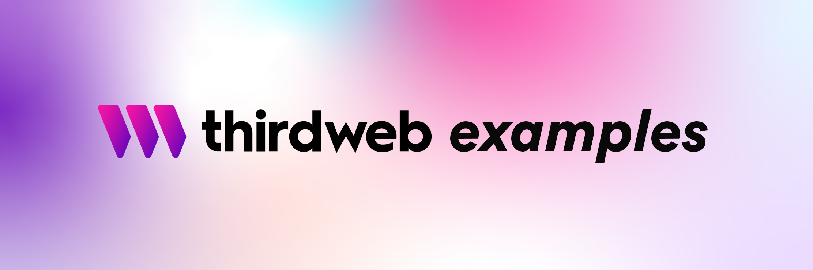

<!-- Banner Image -->

 

  

    web3sdkio examples to kickstart your next project, or to learn more about using web3sdkio's features!
  

 

  <a href="https://portal.web3sdk.io/">web3sdkio Portal</a> •
  <a href="https://github.com/orgs/web3sdkio/repositories">web3sdkio</a> •
  <a href="https://discord.com/invite/web3sdkio">Join our Discord</a>

 

## Starter Kits

| Framework        | Language   | Example Project                                                                    |
| ---------------- | ---------- | ---------------------------------------------------------------------------------- |
| Create React App | JavaScript | [Link](https://github.com/web3sdkio-example/cra-javascript-starter)  |
| Create React App | TypeScript | [Link](https://github.com/web3sdkio-example/cra-typescript-starter)  |
| Next.js          | JavaScript | [Link](https://github.com/web3sdkio-example/next-javascript-starter) |
| Next.js          | TypeScript | [Link](https://github.com/web3sdkio-example/next-typescript-starter) |
| Vite             | JavaScript | [Link](https://github.com/web3sdkio-example/vite-javascript-starter) |
| Vite             | TypeScript | [Link](https://github.com/web3sdkio-example/vite-typescript-starter) |

